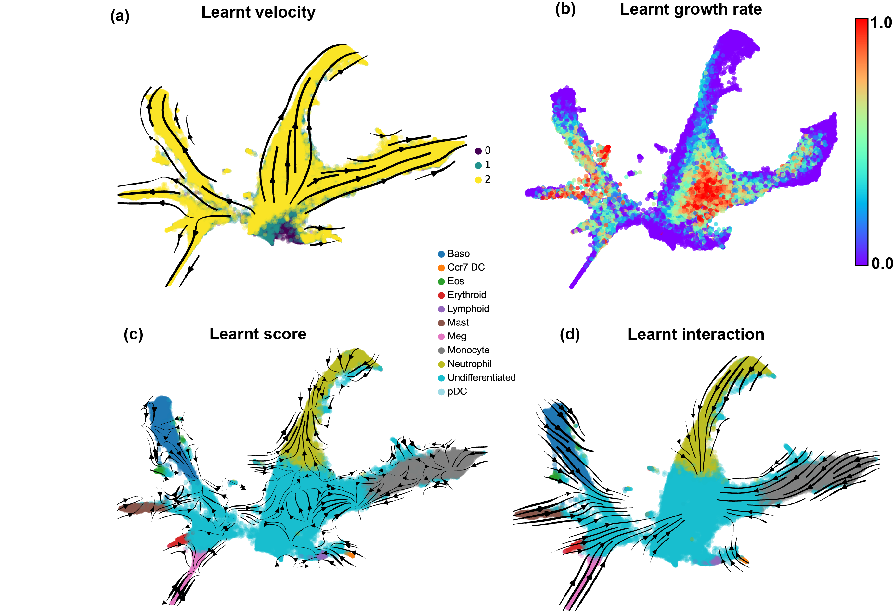

# DeepRUOTv2

**Author**: Zhenyi Zhang, Zihan Wang

This is the DeepRUOTv2 version of our previously published work [DeepRUOT](https://github.com/zhenyiizhang/DeepRUOT). We have improved the implementation of the original DeepRUOT version, offering a more user-friendly interface and establishing default parameters. We have computed results on more datasets presented in our latest work (https://arxiv.org/abs/2505.11197): Mouse Blood Hematopoiesis (50D), Embryoid Body (50D), Pancreatic $\beta$ -cell differentiation (30D) and  A549 EMT (10D). For detailed implementation, please refer to the case in our latest paper without the interaction term (https://arxiv.org/abs/2505.11197).


Results will be presented like this but without interaction (Figure 3 in our [latest work](https://arxiv.org/abs/2505.11197)):
<br />
<div align="left">
  <a href="https://github.com/zhenyiizhang/DeepRUOTv2/">
    
  </a>

</div>

If you are interested in further exploring cell-cell interactions from the data, we plan to release the code following the publication of our work.

## Getting Started

1. Clone this repository:

```vim
git clone https://github.com/zhenyiizhang/DeepRUOTv2
```

2. You can create a new conda environment (DeepRUOTv2) using

```vim
conda create -n DeepRUOTv2 python=3.10 ipykernel -y
conda activate DeepRUOTv2
```

3. Install requirements
```vim
cd path_to_DeepRUOTv2
pip install -r requirements.txt
```

## Training DeepRUOTv2

DeepRUOTv2 uses a flexible configuration system, where users can specify the parameters used to train DeepRUOT. We provide example configurations used to train on four scRNA-seq datasets: Mouse Blood Hematopoiesis (50D), Embryoid Body (50D), Pancreatic $\beta$ -cell differentiation (30D) and  A549 EMT (10D). The configurations are stored in the `config/` folder.

To train DeepRUOTv2 on your own dataset, you need to convert your own dataset to a csv file and store it in the `data/` folder. Specifically, the column `samples` refers to the biological time points starting from time 0, and it is recommended to normalize the time scales to a reasonable range. The following columns, starting from `x1`, refer to the gene expression features. After the dataset is prepared, modify these parts in the confuguration file:

```yaml
device: 'cuda' # device to run the model

exp:
  name: "my_experiment"     # Experiment name

data:
  file_path: "data.csv"     # Path to your dataset, your dataset should be prepared as a csv file
  dim: 50                   # Data dimension

model:
  in_out_dim: 50 # Data dimension
```

For other hyperparameters, we recommend using the same settings as `config/weinreb_config.yaml`. Note that the default setting for the hyperparameter `use_pinn`, which controls whether to update the score model in the final training phase, is set to False. Setting it to True may achieve better performance but will significantly increase training time. For more efficient training, we recommend setting it to False. If you encounter  `CUDA out of memory` error, you may set the parameters `sample_size` and `score_batch_size` to smaller values.

For training, simply specify the path to your configuration file, and run  `train_RUOT.py`:

```bash
python train_RUOT.py --config config/<config_name>.yaml
```

For example, to reproduce our results on the Mouse Blood Hematopoiesis dataset, run:

```bash
python train_RUOT.py --config config/weinreb_config.yaml
```

## Evaluation

 After training, model checkpoints will be generated in the `results/` directory: `model_final` and `score_final`, which can then be used to inference trajectories. We provide a Jupyter notebook to plot the learned results in `evaluation/plot.ipynb`.

## Contact information

If you encounter any issues while running the code, please feel free to contact us and we warmly welcome any discussions and suggestions:

Zhenyi Zhang (zhenyizhang@stu.pku.edu.cn)


## License
DeepRUOTv2 is licensed under the MIT License, and the code from MIOflow used in this project is subject to the Yale Non-Commercial License.

```
License

Copyright (c) 2025 Zhenyi Zhang and Zihan Wang

Permission is hereby granted, free of charge, to any person obtaining a copy
of this software and associated documentation files (the "Software"), to deal
in the Software without restriction, including without limitation the rights
to use, copy, modify, merge, publish, distribute, sublicense, and/or sell
copies of the Software, and to permit persons to whom the Software is
furnished to do so, subject to the following conditions:

The above copyright notice and this permission notice shall be included in all
copies or substantial portions of the Software.

THE SOFTWARE IS PROVIDED "AS IS", WITHOUT WARRANTY OF ANY KIND, EXPRESS OR
IMPLIED, INCLUDING BUT NOT LIMITED TO THE WARRANTIES OF MERCHANTABILITY,
FITNESS FOR A PARTICULAR PURPOSE AND NONINFRINGEMENT. IN NO EVENT SHALL THE
AUTHORS OR COPYRIGHT HOLDERS BE LIABLE FOR ANY CLAIM, DAMAGES OR OTHER
LIABILITY, WHETHER IN AN ACTION OF CONTRACT, TORT OR OTHERWISE, ARISING FROM,
OUT OF OR IN CONNECTION WITH THE SOFTWARE OR THE USE OR OTHER DEALINGS IN THE
SOFTWARE.

The code from MIOflow used in this project is subject to the Yale Non-Commercial License.

```